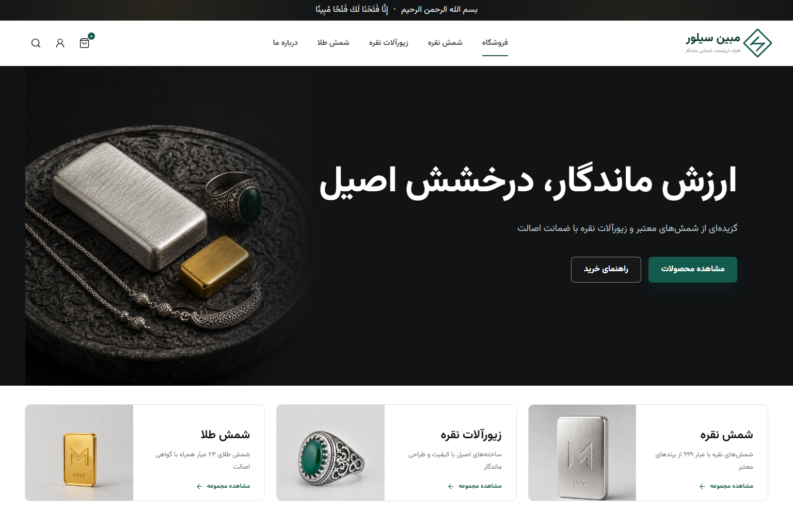

# مبین سیلور | Mobin Silver

فروشگاه اینترنتی فارسی و راست‌چین برای عرضه شمش نقره، زیورآلات نقره و شمش طلا، همراه با مجله تخصصی و پنل مدیریت محتوا؛ توسعه‌یافته با ASP.NET Core، React، TypeScript و SQLite.



## وضعیت پروژه

این مخزن یک نسخه عملیاتی و قابل‌توسعه از فروشگاه مبین سیلور است و بخش‌های فروشگاه عمومی، احراز هویت، سبد خرید، ثبت سفارش، داشبورد مشتری و داشبورد مدیریت را در بر می‌گیرد. اتصال به سرویس‌های تجاری بیرونی مانند درگاه پرداخت، پیامک، قیمت لحظه‌ای فلزات و شرکت حمل‌ونقل در نسخه فعلی شبیه‌سازی شده یا آماده اتصال است و پیش از انتشار عمومی باید با سرویس‌های دارای مجوز جایگزین شود.

## قابلیت‌ها

### فروشگاه و مشتری

- رابط فارسی، RTL و واکنش‌گرا برای دسکتاپ، تبلت و موبایل
- صفحه اصلی لوکس با دسته‌بندی شمش نقره، زیورآلات نقره و شمش طلا
- جست‌وجو، فیلتر دسته‌بندی و مرتب‌سازی محصولات
- صفحه جزئیات محصول، مشخصات فنی، موجودی و محصولات مرتبط
- سبد خرید پایدار در مرورگر و محاسبه مبلغ سفارش
- ثبت‌نام، ورود و احراز هویت مبتنی بر JWT
- ثبت سفارش و نگهداری اقلام، آدرس، مبلغ و وضعیت در پایگاه داده
- داشبورد مشتری شامل تاریخچه سفارش‌ها، وضعیت آخرین سفارش، علاقه‌مندی‌ها، نشانی و حساب کاربری
- مجله تخصصی با جستجو، دسته‌بندی، مقاله ویژه، فهرست مطالب و مطالب مرتبط

### مدیریت

- داشبورد آماری فروش، سفارش‌ها، مشتریان و محصولات کم‌موجود
- نمودار فروش هفتگی و نمایش قیمت و موجودی فلزات
- فهرست، ایجاد و حذف محصول
- مدیریت سفارش‌ها و تغییر وضعیت سفارش
- مشاهده فهرست مشتریان
- جداسازی کامل مسیرها و سطح دسترسی مدیر از مشتری
- مدیریت کامل مقاله‌ها شامل ایجاد، ویرایش، حذف، پیش‌نویس، زمان‌بندی و انتشار

### آدرس نسخه منتشرشده

- فروشگاه و مجله: <https://mobinsilver.00f.ir>
- سلامت سرویس: <https://mobinsilver.00f.ir/api/health>

## فناوری‌ها

| لایه | فناوری |
|---|---|
| Backend | .NET 6, ASP.NET Core Minimal API |
| Persistence | Entity Framework Core 6, SQLite |
| Authentication | JWT Bearer, PBKDF2 password hashing |
| Frontend | React 18, TypeScript, Vite |
| Routing | React Router 7 |
| UI | CSS اختصاصی RTL، Lucide React، Vazirmatn |
| QA | Playwright و Microsoft Edge |

## شروع سریع

پیش‌نیازها:

- .NET SDK 6 یا جدیدتر
- Node.js 20 یا جدیدتر
- Git

ترمینال اول:

```powershell
cd src/MobinSilver.Api
dotnet restore
dotnet run --urls http://127.0.0.1:5088
```

ترمینال دوم:

```powershell
cd src/mobin-silver-web
npm install
npm run dev
```

آدرس‌ها:

- فروشگاه: <http://127.0.0.1:5173>
- سلامت API: <http://127.0.0.1:5088/api/health>
- مستند پایه API: [`docs/api-reference.md`](docs/api-reference.md)

## حساب‌های اولیه محیط توسعه

| نقش | نام کاربری | رمز عبور |
|---|---|---|
| مدیر | `admin` | `admin123` |
| مشتری آزمایشی | `sara` | `sara123` |

> این حساب‌ها صرفاً برای توسعه و نمایش هستند. پیش از هرگونه انتشار عمومی، رمز مدیر را تغییر دهید و داده‌های seed نمایشی را متناسب با محیط حذف یا محدود کنید.

## ساختار مخزن

```text
MobinSilverStore/
├── src/
│   ├── MobinSilver.Api/          # ASP.NET Core API و EF Core
│   └── mobin-silver-web/         # React + TypeScript + Vite
├── docs/                          # مستندات فنی، نمودارها و راهنمای پشتیبانی
├── design/concepts/               # کانسپت‌های تصویری مرجع
├── qa/                            # اسکرین‌شات‌های کنترل کیفیت
├── development.md                 # راهنمای توسعه‌دهندگان
├── deployment.md                  # راهنمای استقرار
└── DESIGN_SYSTEM.md               # سیستم طراحی رابط کاربری
```

## مستندات

- [راهنمای توسعه](development.md)
- [راهنمای استقرار](deployment.md)
- [فهرست مستندات فنی](docs/README.md)
- [معماری سامانه](docs/architecture.md)
- [مدل داده و ERD](docs/data-model.md)
- [مرجع API](docs/api-reference.md)
- [یوزکیس‌ها و نمودار Use Case](docs/diagrams/use-cases.md)
- [نمودارهای Activity](docs/diagrams/activity-diagrams.md)
- [نمودارهای Sequence](docs/diagrams/sequence-diagrams.md)
- [امنیت](docs/security.md)
- [عملیات، مانیتورینگ و پشتیبانی](docs/operations-support.md)
- [راهبرد تست](docs/testing.md)
- [راهنمای فنی و محتوایی مجله](docs/blog.md)
- [نقشه راه](docs/roadmap.md)
- [راهنمای مشارکت](CONTRIBUTING.md)
- [سیاست امنیت](SECURITY.md)
- [راهنمای پشتیبانی](SUPPORT.md)

## بیلد و تست

```powershell
dotnet build src/MobinSilver.Api/MobinSilver.Api.csproj -c Release
cd src/mobin-silver-web
npm ci
npm run build
npm run test:e2e
npm audit --omit=dev
```

آخرین کنترل کیفیت نسخه تحویلی:

- بیلد Release بک‌اند: صفر خطا و صفر هشدار
- بیلد production فرانت‌اند: موفق
- ممیزی وابستگی‌های اصلی: صفر آسیب‌پذیری شناخته‌شده
- ۴ سناریوی خودکار Playwright برای فروشگاه، مجله، موبایل و مدیریت: موفق
- تست سبد، پنل‌ها و ناوبری: موفق
- تست موبایل 390 پیکسل: بدون overflow افقی
- خطاهای Console مرورگر: صفر

## پیکربندی و اسرار

هیچ رمز یا کلید production نباید داخل Git ثبت شود. تنظیمات حساس با متغیرهای محیطی تأمین می‌شوند؛ برای نمونه:

```powershell
$env:Jwt__Key = "A-STRONG-RANDOM-SECRET-AT-LEAST-32-CHARS"
$env:ConnectionStrings__Default = "Data Source=C:\secure-data\mobinsilver.db"
```

در لینوکس یا سرویس‌های ابری همین کلیدها را در Secret Manager یا تنظیمات امن سرویس قرار دهید. جزئیات کامل در [راهنمای استقرار](deployment.md) و [مستند امنیت](docs/security.md) آمده است.

## مشارکت و پشتیبانی

برای هر تغییر، یک branch جدا بسازید، تست‌ها و بیلد را اجرا کنید و Pull Request بدهید. قواعد branch، نام commit، Definition of Done و چک‌لیست توسعه در [development.md](development.md) قرار دارد. فرآیند رخداد، بکاپ، بازیابی، مانیتورینگ و Runbook پشتیبانی نیز در [docs/operations-support.md](docs/operations-support.md) مستند شده است.
