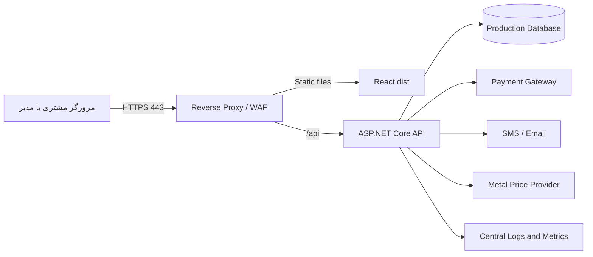

# راهنمای استقرار مبین سیلور

این سند مسیر استقرار امن و قابل پشتیبانی را از build تا rollback توضیح می‌دهد. معماری نمونه شامل reverse proxy، فرانت‌اند استاتیک و ASP.NET Core API است.

## استقرار فعلی Mobin Silver

- دامنه عمومی: `https://mobinsilver.00f.ir`
- برنامه: یک artifact framework-dependent شامل ASP.NET Core و خروجی React در `wwwroot`؛ اجرا روی runtime نصب‌شده با `DOTNET_ROLL_FORWARD=Major`
- مسیر پایه برنامه: `/opt/mobinsilver`
- داده پایدار: `/opt/mobinsilver/shared/App_Data`
- سرویس: `mobinsilver.service`
- پورت داخلی Kestrel: `5098`
- Reverse proxy: Nginx کانتینری مستقل؛ upstream برابر سرویس Kestrel

رمز SSH، کلید JWT و فایل محیطی سرور هرگز در مخزن قرار نمی‌گیرند. Nginx و میزبان برنامه چند پروژه دیگر دارند؛ فقط service، مسیر و server block نام‌برده در این سند باید تغییر کنند.

## 1. پیش‌شرط‌های Production

پیش از انتشار عمومی باید این موارد تعیین و فراهم شوند:

- دامنه و گواهی TLS معتبر
- سرور Windows/IIS یا Linux/Nginx با .NET Runtime سازگار
- مسیر پایدار و دارای بکاپ برای داده‌ها؛ برای مقیاس بالاتر PostgreSQL یا SQL Server
- Secret Manager یا متغیر محیطی امن برای JWT و کلید سرویس‌های بیرونی
- حساب مدیر با رمز قوی و غیرپیش‌فرض
- درگاه پرداخت و webhook دارای امضای معتبر
- سرویس پیامک، ایمیل، قیمت فلزات، حمل‌ونقل و فاکتور رسمی
- سامانه log مرکزی، مانیتورینگ و هشدار
- برنامه بکاپ، retention، بازیابی و rollback آزمایش‌شده

## 2. متغیرهای محیطی

| متغیر | کاربرد | نمونه |
|---|---|---|
| `ASPNETCORE_ENVIRONMENT` | نام محیط | `Production` |
| `ASPNETCORE_URLS` | آدرس داخلی API | `http://127.0.0.1:5088` |
| `Jwt__Key` | کلید امضای JWT؛ حداقل 32 کاراکتر تصادفی | secret |
| `Jwt__Issuer` | صادرکننده token | `MobinSilver.Api` |
| `Jwt__Audience` | مخاطب token | `MobinSilver.Web` |
| `ConnectionStrings__Default` | اتصال پایگاه داده | مسیر امن یا connection string |

کلیدها را در فایل tracked، تصویر Docker، command history عمومی یا CI log قرار ندهید.

## 3. Build قابل تکرار

از ریشه مخزن، ابتدا React را build و داخل `wwwroot` API کپی کنید، سپس artifact یکپارچه بسازید:

```powershell
cd src/mobin-silver-web
npm ci
npm run build
npm run test:e2e
cd ../..

# محتوای dist را در src/MobinSilver.Api/wwwroot قرار دهید
dotnet restore src/MobinSilver.Api/MobinSilver.Api.csproj
dotnet publish src/MobinSilver.Api/MobinSilver.Api.csproj -c Release --no-restore -o artifacts/mobinsilver-linux
```

خروجی‌ها:

- artifact یکپارچه: `artifacts/mobinsilver-linux`
- خروجی میانی frontend: `src/mobin-silver-web/dist`

قبل از استقرار، checksum artifactها و شناسه commit را در release ثبت کنید.

## 4. توپولوژی پیشنهادی



## 5. استقرار Linux و Nginx

### سرویس systemd نمونه

```ini
[Unit]
Description=Mobin Silver API
After=network.target

[Service]
WorkingDirectory=/opt/mobinsilver/current
ExecStart=/usr/local/bin/dotnet /opt/mobinsilver/current/MobinSilver.Api.dll
Restart=always
RestartSec=5
User=mobinsilver
Group=mobinsilver
Environment=ASPNETCORE_ENVIRONMENT=Production
Environment=ASPNETCORE_URLS=http://0.0.0.0:5098
Environment=DOTNET_ROLL_FORWARD=Major
EnvironmentFile=/etc/mobinsilver.env
NoNewPrivileges=true
PrivateTmp=true
ProtectHome=true
ReadWritePaths=/opt/mobinsilver/shared/App_Data

[Install]
WantedBy=multi-user.target
```

فایل `/etc/mobinsilver/api.env` باید فقط برای کاربر سرویس قابل خواندن باشد و داخل Git قرار نگیرد.

### Nginx نمونه برای معماری یکپارچه

```nginx
server {
    listen 443 ssl http2;
    server_name mobinsilver.example;

    location / {
        proxy_pass http://app-server:5098;
        proxy_set_header Host $host;
        proxy_set_header X-Real-IP $remote_addr;
        proxy_set_header X-Forwarded-For $proxy_add_x_forwarded_for;
        proxy_set_header X-Forwarded-Proto $scheme;
    }

}
```

TLS، HSTS، CSP، محدودسازی request body و rate limit را مطابق زیرساخت سازمانی فعال کنید.

## 6. استقرار Windows و IIS

1. ASP.NET Core Hosting Bundle سازگار را نصب کنید.
2. خروجی `dotnet publish` را در مسیر نسخه‌دار قرار دهید.
3. Application Pool مستقل با `No Managed Code` بسازید.
4. فرانت‌اند `dist` را به‌عنوان محتوای استاتیک منتشر کنید.
5. URL Rewrite یا reverse proxy را برای `/api` به Kestrel تنظیم کنید.
6. اسرار را در متغیر محیطی App Pool یا secret store سازمان قرار دهید.
7. مجوز نوشتن را فقط برای مسیر داده و لاگ مورد نیاز به identity سرویس بدهید.
8. Health check و recycle کنترل‌شده را فعال کنید.

## 7. پایگاه داده

SQLite برای نصب تک‌نمونه و ترافیک محدود مناسب است. برای چند replica، سفارش‌های پرتعداد یا نیازهای گزارش‌گیری، PostgreSQL یا SQL Server توصیه می‌شود.

قواعد انتشار schema:

1. قبل از migration بکاپ سازگار بگیرید.
2. migration را روی staging با حجم داده نزدیک production اجرا کنید.
3. زمان lock و سازگاری نسخه قدیم/جدید را بررسی کنید.
4. ابتدا تغییر سازگار با عقب، سپس نسخه برنامه و در انتشار بعد cleanup را انجام دهید.
5. نتیجه migration و شماره نسخه schema را ثبت کنید.

## 8. فرایند Release

1. Pull Request تأیید و branch اصلی سبز باشد.
2. نسخه semantic و changelog مشخص شود.
3. artifactها فقط یک‌بار build و بین محیط‌ها promote شوند.
4. بکاپ دیتابیس و تنظیمات تأیید شود.
5. migration سازگار اجرا شود.
6. API جدید روی slot یا مسیر نسخه‌دار بالا بیاید.
7. health، login، products و یک سفارش synthetic کنترل شود.
8. فرانت‌اند با cache policy مناسب منتشر شود.
9. ترافیک به نسخه جدید منتقل شود.
10. متریک‌ها و خطاها حداقل 30 دقیقه زیر نظر باشند.

## 9. Smoke Test پس از استقرار

- `GET /api/health` برابر `200` و `healthy`
- صفحه اصلی، assetها و فونت بدون 404
- فهرست مجله، جستجو و یک صفحه مقاله
- بخش مقالات ادمین و بازشدن فرم ایجاد مقاله
- ورود مشتری و مدیر
- مشاهده محصولات و جزئیات
- افزودن سبد و ادامه خرید
- ثبت سفارش آزمایشی در sandbox درگاه
- مشاهده سفارش در پنل مدیر و مشتری
- تغییر وضعیت سفارش
- نبود افزایش غیرعادی 4xx، 5xx یا latency

## 10. Rollback

شرایط rollback فوری:

- خطای پایدار ورود یا ثبت سفارش
- ناسازگاری داده یا migration شکست‌خورده
- افزایش شدید 5xx یا latency
- مشکل امنیتی یا نشت اطلاعات
- شکست callback پرداخت

مراحل:

1. انتشار را متوقف و مسئول رخداد را مشخص کنید.
2. ترافیک را به artifact قبلی سالم برگردانید.
3. migration را فقط با روش از قبل آزمایش‌شده rollback کنید؛ در غیر این صورت نسخه برنامه سازگار با schema جدید اجرا شود.
4. health و سناریوهای حیاتی را دوباره کنترل کنید.
5. رخداد، timeline، اثر و اقدامات اصلاحی ثبت شوند.

## 11. بکاپ و بازیابی

- بکاپ روزانه کامل و بکاپ افزایشی/لاگ مطابق موتور پایگاه داده
- رمزنگاری در انتقال و محل ذخیره
- نگهداری حداقل یک کپی خارج از سرور اصلی
- retention متناسب با مقررات مالی و حریم خصوصی
- تست بازیابی دوره‌ای؛ وجود فایل بکاپ به‌تنهایی کافی نیست
- تعریف و تصویب RPO و RTO توسط کسب‌وکار

برای SQLite، بکاپ سازگار باید با توقف کوتاه writeها یا ابزار backup آنلاین SQLite انجام شود؛ کپی خام فایل هنگام تراکنش فعال ممکن است ناسازگار باشد.

## 12. درگاه پرداخت

نسخه فعلی ثبت سفارش را انجام می‌دهد اما پرداخت واقعی نیست. تا زمانی که Payment Gateway و webhook امن پیاده نشده‌اند، وضعیت سفارش نباید معادل تسویه مالی قطعی تفسیر شود. طراحی چرخه آینده در [نمودارهای توالی](docs/diagrams/sequence-diagrams.md) آمده است.

## 13. اسناد مرتبط

- [امنیت](docs/security.md)
- [عملیات و پشتیبانی](docs/operations-support.md)
- [راهبرد تست](docs/testing.md)
- [معماری](docs/architecture.md)
