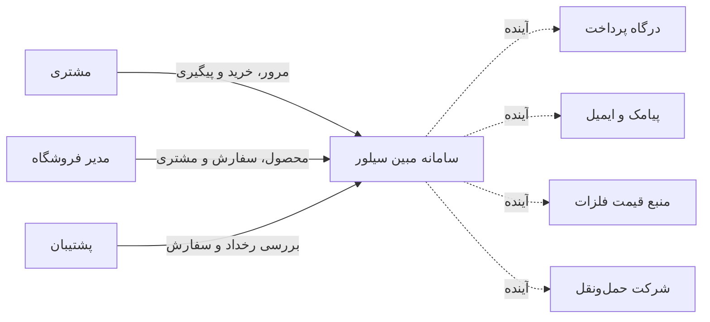
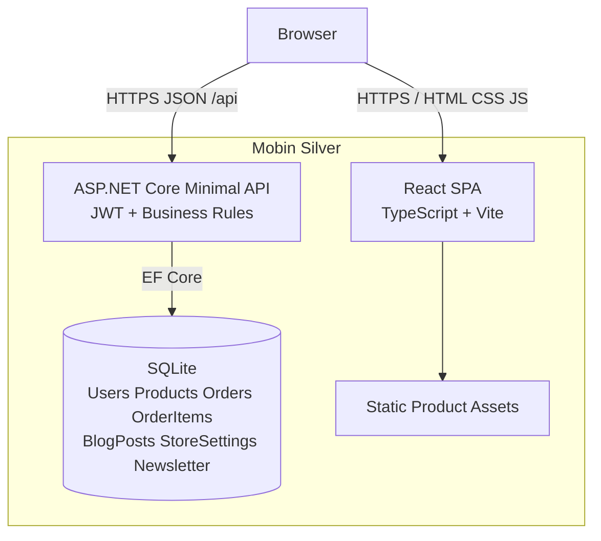
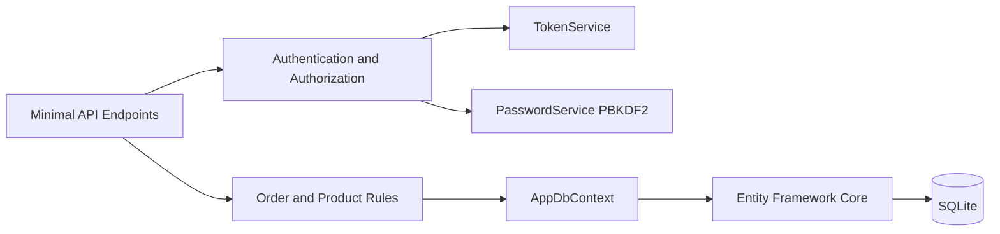
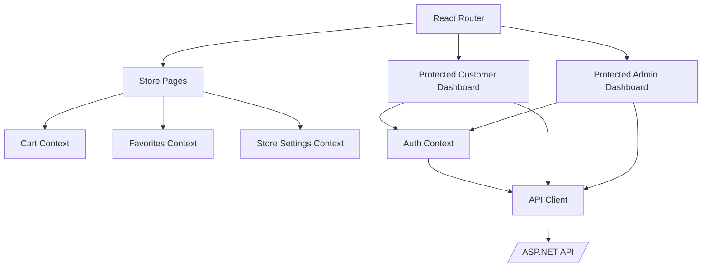
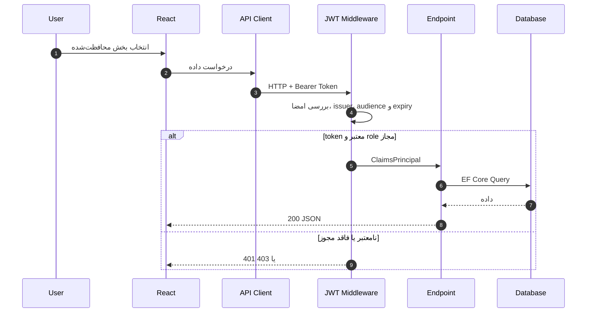
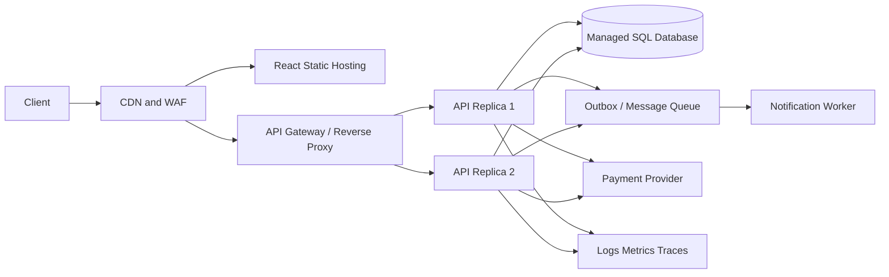

# معماری سامانه مبین سیلور

## 1. هدف و دامنه

سامانه سه سطح تجربه ارائه می‌کند: فروشگاه عمومی، پنل مشتری و پنل مدیریت. React مسئول رابط و وضعیت موقت مرورگر است؛ ASP.NET Core قوانین سرور، احراز هویت و API را اجرا می‌کند؛ EF Core داده پایدار را در SQLite نگه می‌دارد.

## 2. System Context

خطوط پیوسته بخشی از نسخه فعلی و خطوط نقطه‌چین یکپارچه‌سازی پیشنهادی production هستند.

## 3. Container Diagram

در development، Vite درخواست `/api` را به Kestrel روی پورت 5088 proxy می‌کند. در production، reverse proxy باید همین مرز را با HTTPS ارائه کند.

## 4. اجزای Backend

- `Program.cs`: composition root، pipeline، routeها و قوانین فعلی
- `TokenService`: ایجاد JWT شامل شناسه، نام و role
- `PasswordService`: salt تصادفی و PBKDF2 برای hash/verify
- `AppDbContext`: query، persistence، index و precision
- `Entities.cs`: مدل دامنه و serialization boundary

برای رشد پروژه توصیه می‌شود endpointها به feature modules، validation و serviceهای کاربردی مستقل تفکیک شوند؛ این تغییر در [نقشه راه](roadmap.md) ثبت شده است.

## 5. اجزای Frontend

- Auth token در نسخه فعلی در `localStorage` قرار می‌گیرد.
- سبد و علاقه‌مندی‌ها برای تجربه سریع در مرورگر پایدار می‌شوند.
- تنظیمات عمومی فروشگاه از API بارگذاری و در `StoreContext` بین هدر و footer مشترک می‌شوند.
- صفحه‌های route-level به‌صورت lazy chunk بارگذاری می‌شوند تا باندل اولیه کوچک بماند.
- `ProtectedRoute` نقش و ورود را قبل از نمایش dashboard کنترل می‌کند؛ کنترل اصلی امنیت همچنان در API است.
- CSS اختصاصی تمام layoutهای RTL و breakpointها را مدیریت می‌کند.

## 6. جریان یک درخواست محافظت‌شده

## 7. مرزهای امنیت و اعتماد

- هر ورودی مرورگر غیرقابل اعتماد است؛ قیمت و مبلغ سفارش فقط از محصول سرور محاسبه می‌شود.
- نقش ارسال‌شده از frontend معتبر نیست؛ role از claim امضاشده و policy سرور خوانده می‌شود.
- مسیرهای `/api/admin/*` به policy `Admin` نیاز دارند.
- داده شخصی، token و secret نباید در log یا repository ثبت شوند.
- API ورود limiter حافظه‌ای IP + نام کاربری دارد؛ reverse proxy همچنان مرز rate limit سراسری، TLS، headerهای امنیتی و محدودسازی اندازه درخواست است.
- سرویس پرداخت آینده باید webhook امضاشده، idempotency و تطبیق مبلغ سمت سرور داشته باشد.

## 8. ویژگی‌های کیفیتی

| ویژگی | وضعیت فعلی | مسیر رشد |
|---|---|---|
| قابلیت استفاده | RTL، responsive، فونت محلی | تست دسترس‌پذیری خودکار |
| امنیت | JWT، PBKDF2، role policy، login throttle | HttpOnly cookie/refresh، limiter توزیع‌شده، MFA ادمین |
| کارایی | SPA و queryهای AsNoTracking | pagination، caching، CDN، image optimization |
| پایداری | SQLite تک‌نمونه | PostgreSQL/SQL Server، migration و HA |
| مشاهده‌پذیری | logging پایه ASP.NET | structured logs، tracing، metrics و alerts |
| تست‌پذیری | build و E2E smoke | unit، integration و CI کامل |

## 9. تصمیم‌های معماری

### ADR-001: React SPA + ASP.NET Core API

- تصمیم: جداسازی UI و API با قرارداد JSON
- دلیل: توسعه مستقل dashboardها، امکان app موبایل آینده و استفاده از اکوسیستم .NET
- پیامد: نیاز به مدیریت CORS، auth token و deployment دو artifact

### ADR-002: SQLite برای نسخه اولیه

- تصمیم: SQLite + EF Core برای اجرای بدون زیرساخت جانبی
- دلیل: راه‌اندازی و تحویل سریع، مناسب demo و نصب تک‌نمونه
- پیامد: برای چند replica و بار بالاتر باید موتور داده تغییر کند

### ADR-003: نمودارهای Mermaid در Git

- تصمیم: نگهداری diagram-as-code
- دلیل: نمایش مستقیم GitHub، diff‌پذیری و همگام‌سازی ساده با کد
- پیامد: syntax نمودارها باید در PR بررسی شود

## 10. معماری هدف Production

این نمودار هدف آینده است و همه اجزای آن در نسخه جاری پیاده نشده‌اند.
