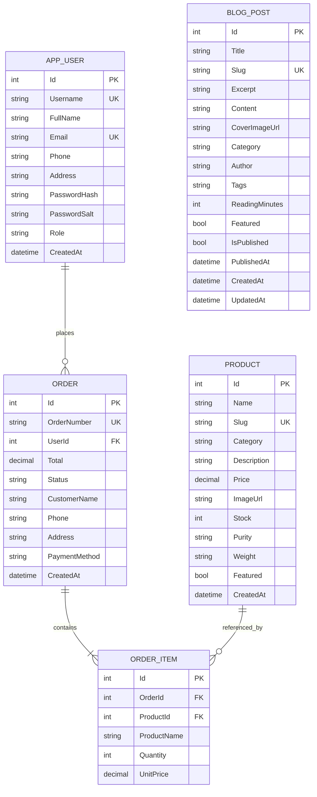
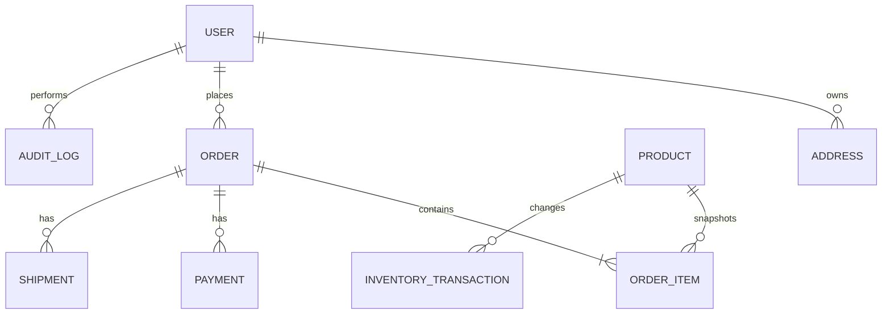

# مدل داده و ERD

## 1. نمودار رابطه موجودیت‌ها

## 2. موجودیت‌ها

### AppUser

کاربر احرازشده سامانه است. `Username` و `Email` unique هستند. `Role` در نسخه فعلی `Admin` یا `Customer` است. رمز خام هرگز ذخیره نمی‌شود و فقط hash و salt نگهداری می‌شوند.

### Product

کالای قابل فروش است. `Slug` unique و برای URL محصول استفاده می‌شود. دسته‌های فعلی:

- `silver-bar`
- `silver-jewelry`
- `gold-bar`

`Price` مبلغ صحیح به تومان با precision برابر `(18,0)` است. `Stock` موجودی واحد قابل سفارش است.

### Order

snapshot اطلاعات تحویل و پرداخت در لحظه سفارش را نگه می‌دارد. نگهداری نام، تلفن و آدرس روی سفارش عمدی است تا تغییر پروفایل تاریخچه ارسال قبلی را عوض نکند. `OrderNumber` unique است.

### OrderItem

قیمت و نام محصول را در لحظه سفارش snapshot می‌کند؛ بنابراین تغییر نام یا قیمت محصول روی فاکتور تاریخی اثر ندارد. رابطه با `Product` برای ردیابی محصول اصلی باقی می‌ماند.

### BlogPost

محتوای مجله را نگه می‌دارد. `Slug` یکتا و مبنای URL مقاله است. ترکیب `IsPublished` و `PublishedAt` تعیین می‌کند مقاله در API عمومی دیده شود یا به‌صورت پیش‌نویس/زمان‌بندی‌شده فقط در پنل مدیر باقی بماند. index ترکیبی روی این دو فیلد query انتشار را پشتیبانی می‌کند.

## 3. قواعد یکپارچگی فعلی

- سفارش باید حداقل یک قلم داشته باشد؛ این قاعده در endpoint کنترل می‌شود.
- Quantity باید حداقل یک و کمتر یا مساوی Stock باشد.
- مبلغ نهایی از قیمت ذخیره‌شده در Product سمت سرور محاسبه می‌شود.
- موجودی هنگام ایجاد سفارش کم می‌شود.
- سفارش فقط به کاربر احرازشده تعلق می‌گیرد.
- query سفارش مشتری با `UserId` claim محدود می‌شود.
- index یکتا برای Username، Email، Slug محصول، Slug مقاله و OrderNumber وجود دارد.

## 4. وضعیت سفارش

مقادیر seed و UI فعلی شامل این وضعیت‌ها هستند:

- `در انتظار بررسی`
- `پرداخت شده`
- `در حال آماده‌سازی`
- `ارسال شده`
- `تحویل شده`
- `لغو شده`

در نسخه آینده وضعیت باید enum یا lookup کنترل‌شده باشد و transition نامعتبر در domain service رد شود. اکنون endpoint مدیریت یک string دریافت می‌کند؛ این مورد در نقشه راه امنیت و صحت داده اولویت بالایی دارد.

## 5. تراکنش و همزمانی

ایجاد Order، OrderItemها و کاهش Stock در یک `SaveChanges` انجام می‌شود و EF Core یک تراکنش ایجاد می‌کند. برای ترافیک production باید:

- optimistic concurrency token روی Product اضافه شود
- سفارش تکراری با idempotency key مهار شود
- oversell زیر بار همزمان با تست integration بررسی شود
- رزرو موجودی و timeout پرداخت طراحی شود

## 6. مهاجرت پیشنهادی به دیتابیس Production

1. افزودن EF Core migrations و حذف اتکا به `EnsureCreated`
2. انتخاب PostgreSQL یا SQL Server
3. افزودن جداول `Payments`، `InventoryTransactions`، `Addresses` و `AuditLogs`
4. افزودن `RowVersion` یا concurrency token
5. افزودن indexهای query محور روی `CreatedAt`، `Status`، `UserId` و `Category`
6. تعریف سیاست retention برای PII و audit
7. migration آزمایشی داده seed و staging پیش از production

## 7. مدل داده هدف پیشنهادی

بخش هدف برای برنامه‌ریزی توسعه است و در schema فعلی وجود ندارد.
