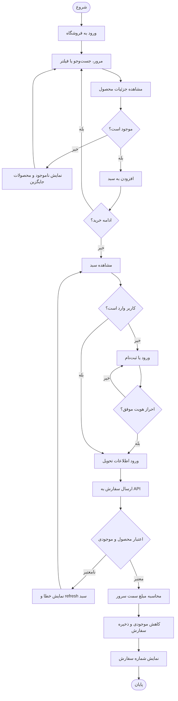
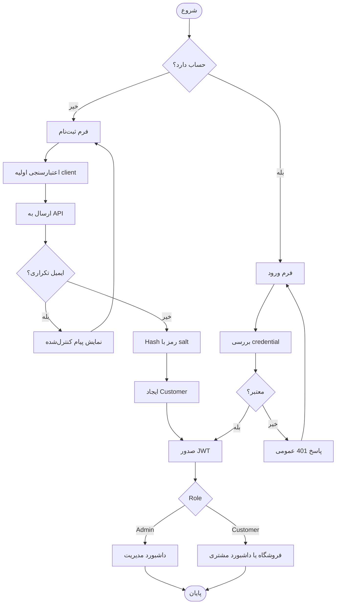
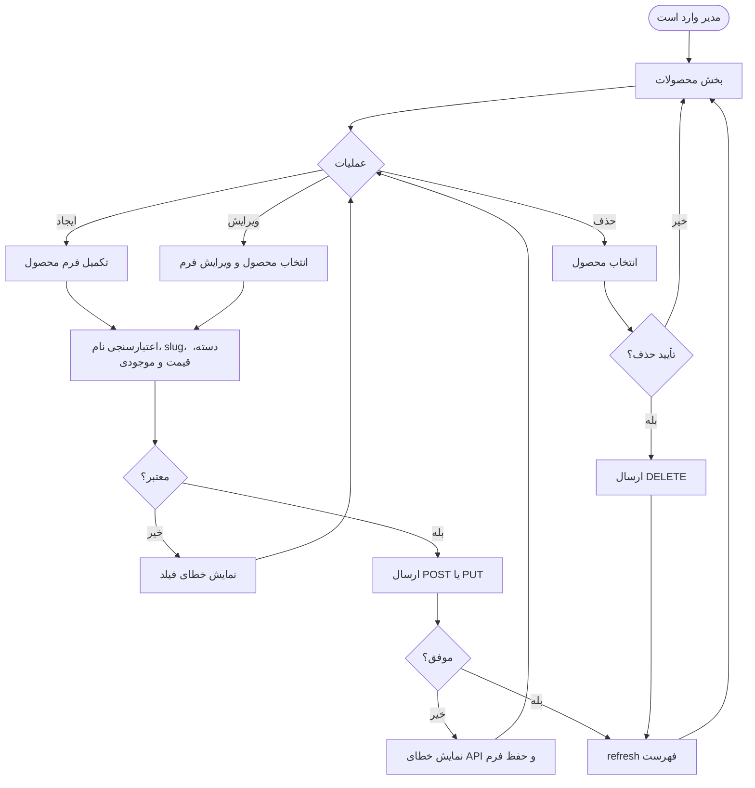
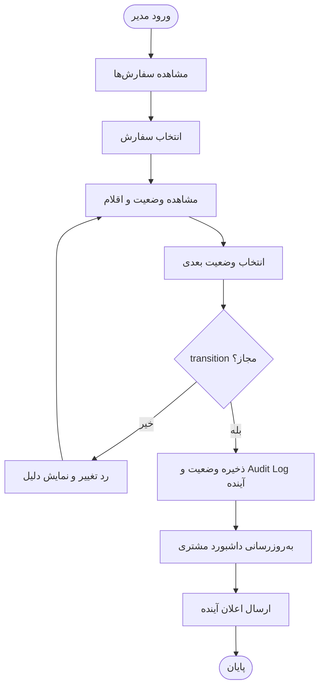
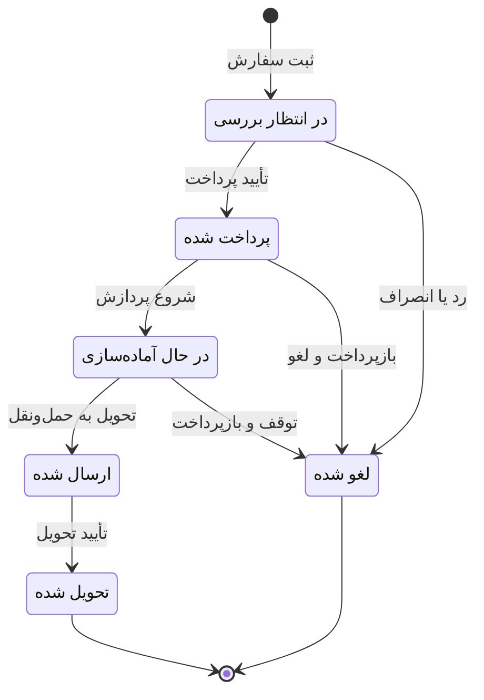
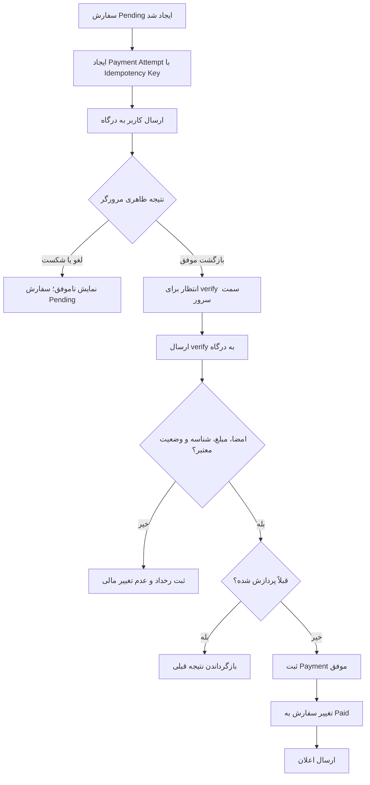
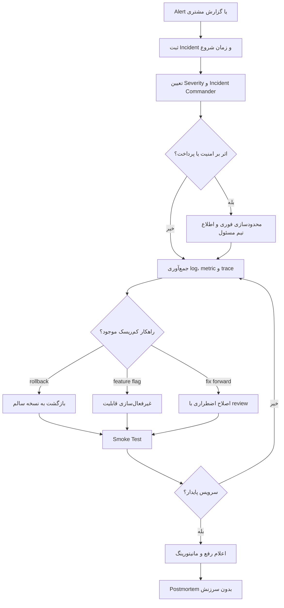

# نمودارهای Activity و وضعیت

## 1. فعالیت مرور تا ثبت سفارش

## 2. فعالیت ثبت‌نام و ورود

## 3. فعالیت مدیریت محصول

## 4. فعالیت تغییر وضعیت سفارش

در نسخه جاری کنترل role و ذخیره وضعیت وجود دارد، اما whitelist transition، Audit Log و اعلان هنوز باید اضافه شوند.

## 5. نمودار وضعیت سفارش

این ماشین وضعیت، طراحی هدف است. در نسخه فعلی status رشته‌ای است و مدیر می‌تواند مقدار را تغییر دهد؛ پیاده‌سازی transition guard یکی از اقدامات اولویت‌دار است.

## 6. فعالیت پرداخت امن آینده

## 7. فعالیت رسیدگی به رخداد Production

