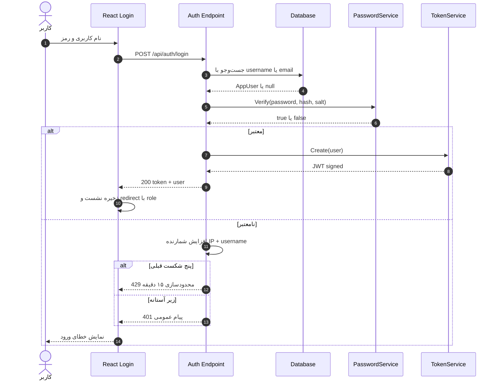
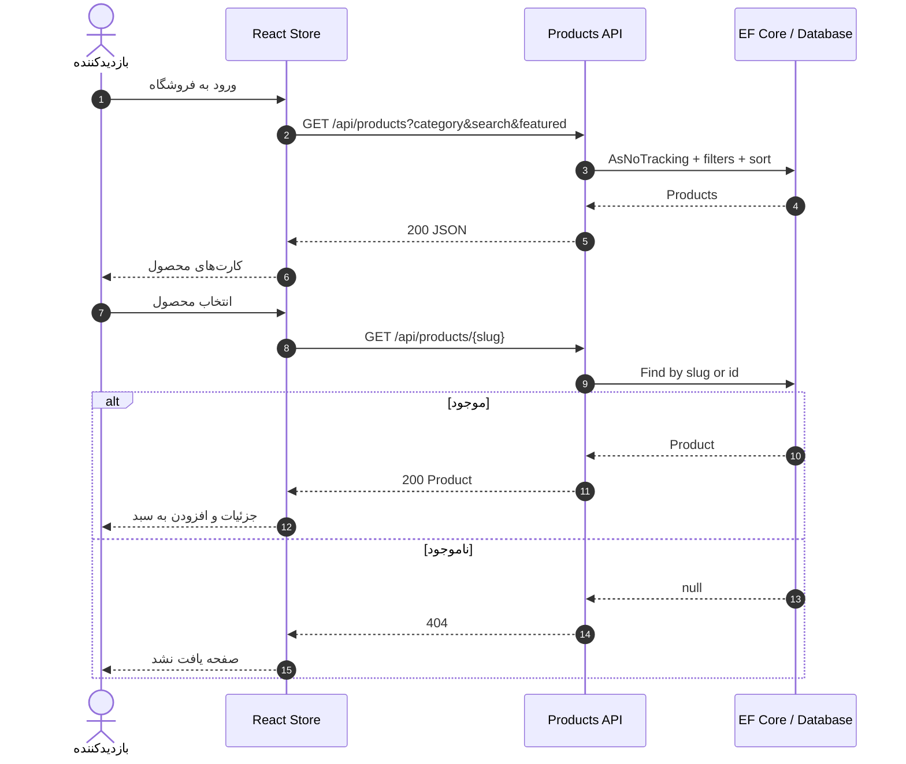
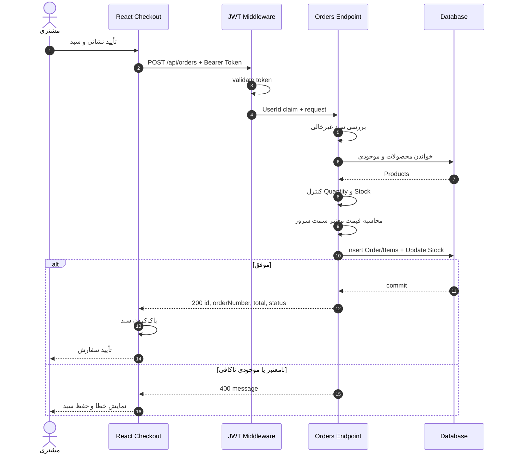
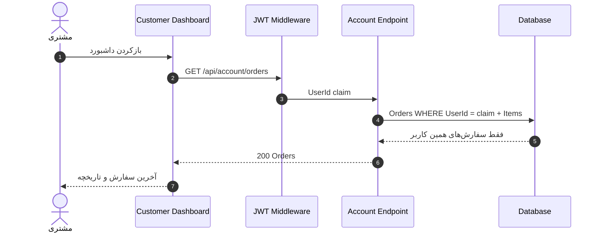
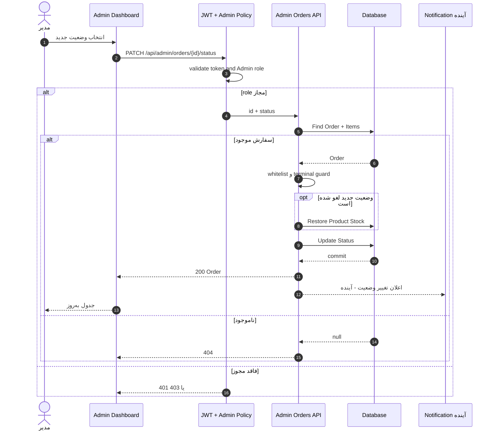
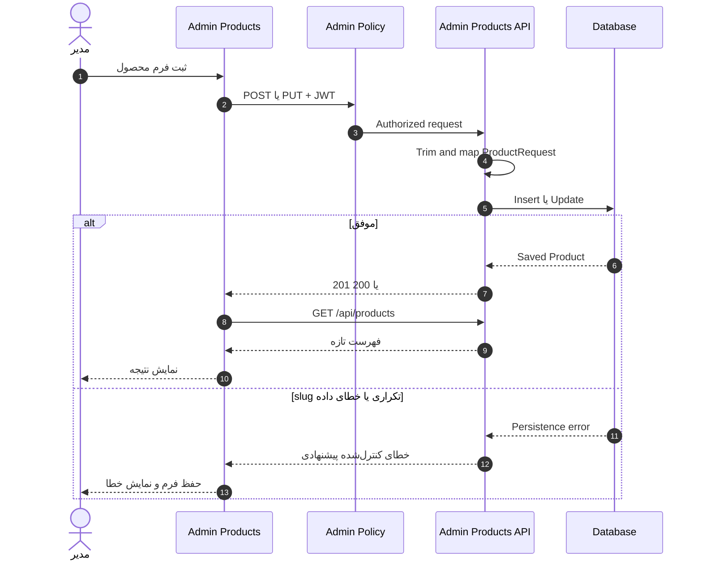
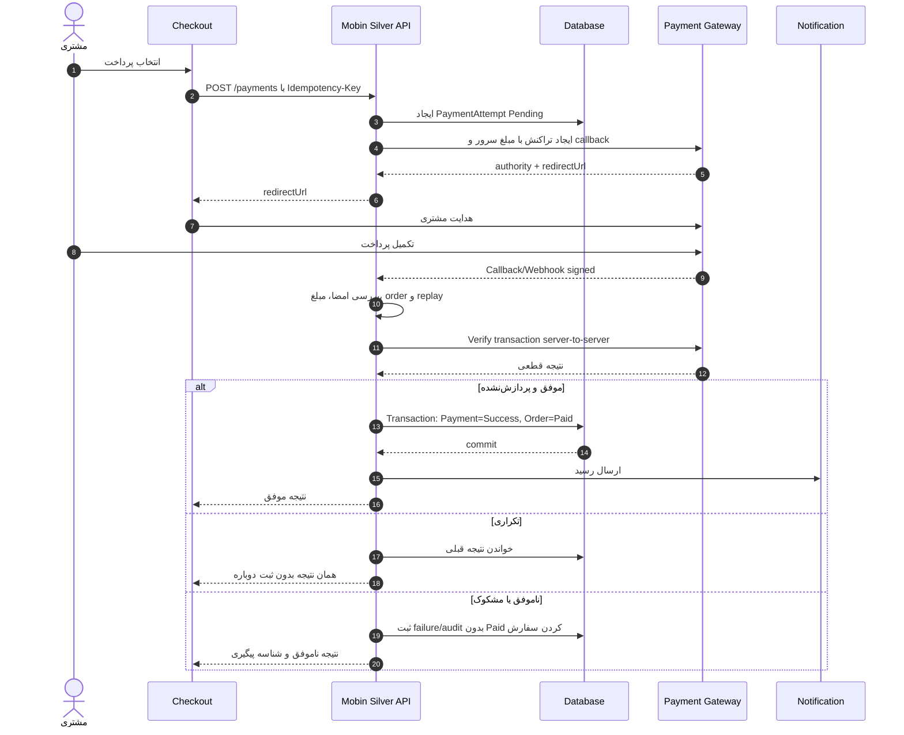
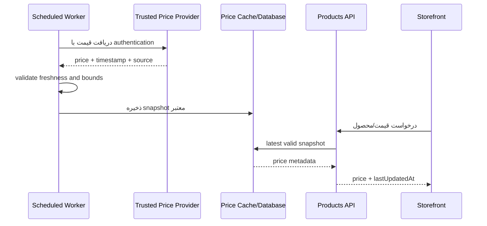

# نمودارهای Sequence

## 1. ورود و صدور JWT

## 2. دریافت محصولات و جزئیات

## 3. ثبت سفارش فعلی

## 4. مشاهده سفارش‌های مشتری

## 5. تغییر وضعیت توسط مدیر

## 6. مدیریت محصول

## 7. پرداخت امن پیشنهادی آینده

## 8. قیمت لحظه‌ای فلزات پیشنهادی

