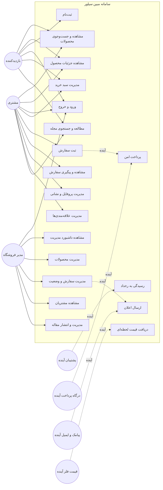

# یوزکیس‌ها و Use Case Diagram

## 1. بازیگران

| بازیگر | شرح |
|---|---|
| بازدیدکننده | کاربر واردنشده که محصولات و اطلاعات فروشگاه را می‌بیند |
| مشتری | کاربر ثبت‌شده که سبد، سفارش و حساب خود را مدیریت می‌کند |
| مدیر فروشگاه | کاربر نقش Admin برای محصول، سفارش، مشتری و آمار |
| پشتیبان | نقش سازمانی آینده برای رسیدگی به رخداد و مشتری؛ مجوز مستقل هنوز پیاده نشده است |
| درگاه پرداخت | سرویس بیرونی آینده برای ایجاد پرداخت و callback |
| سرویس پیام‌رسانی | پیامک/ایمیل آینده برای تأیید و تغییر وضعیت |
| منبع قیمت فلزات | سرویس آینده قیمت لحظه‌ای طلا و نقره |

## 2. نمودار جامع Use Case

## 3. UC-01: مرور، جست‌وجو و فیلتر محصول

- بازیگر اصلی: بازدیدکننده یا مشتری
- پیش‌شرط: فروشگاه و API در دسترس باشند
- محرک: کاربر وارد صفحه فروشگاه یا دسته‌بندی می‌شود
- جریان اصلی:
  1. سامانه محصولات را دریافت می‌کند.
  2. کاربر دسته، عبارت جست‌وجو یا ترتیب را انتخاب می‌کند.
  3. سامانه فهرست مطابق فیلتر را نمایش می‌دهد.
  4. کاربر یک محصول را برای جزئیات انتخاب می‌کند.
- جریان جایگزین: در نبود نتیجه، Empty State و راه بازگشت به همه محصولات نمایش داده می‌شود.
- پس‌شرط: هیچ داده مالی تغییر نمی‌کند.
- معیار پذیرش: فیلتر دسته و جست‌وجو همزمان درست کار کنند و URL/رابط روی موبایل قابل استفاده باشد.

## 4. UC-02: مدیریت سبد خرید

- بازیگر اصلی: بازدیدکننده یا مشتری
- پیش‌شرط: محصول موجود باشد
- جریان اصلی:
  1. کاربر محصول را به سبد اضافه می‌کند.
  2. سامانه تعداد و مبلغ محلی را به‌روزرسانی می‌کند.
  3. کاربر تعداد را تغییر می‌دهد یا قلم را حذف می‌کند.
  4. سامانه جمع جدید را نشان می‌دهد.
- استثنا: quantity کمتر از یک به حذف یا حداقل مجاز تبدیل می‌شود.
- پس‌شرط: سبد در مرورگر پایدار است؛ هنوز سفارش سرور ایجاد نشده است.

## 5. UC-03: ثبت‌نام مشتری

- بازیگر اصلی: بازدیدکننده
- پیش‌شرط: ایمیل قبلاً ثبت نشده باشد
- جریان اصلی:
  1. نام، ایمیل، رمز و تلفن وارد می‌شود.
  2. API تکراری نبودن ایمیل را بررسی می‌کند.
  3. رمز با salt مستقل hash می‌شود.
  4. کاربر با نقش Customer ذخیره می‌شود.
  5. JWT صادر و نشست frontend ایجاد می‌شود.
- استثنا: ایمیل تکراری یا داده نامعتبر با پیام کنترل‌شده رد می‌شود.
- پس‌شرط: حساب Customer ایجاد شده و کاربر وارد است.

## 6. UC-04: ورود

- بازیگران: مشتری و مدیر
- جریان اصلی:
  1. نام کاربری/ایمیل و رمز ارسال می‌شود.
  2. hash رمز بررسی می‌شود.
  3. JWT شامل شناسه و role صادر می‌شود.
  4. frontend بر اساس role مسیر مناسب را نمایش می‌دهد.
- استثنا: credential اشتباه پاسخ 401 عمومی دارد.
- معیار امنیتی: پاسخ نباید وجود یا عدم وجود نام کاربری را افشا کند.

## 7. UC-05: ثبت سفارش

- بازیگر اصلی: مشتری
- پیش‌شرط: ورود معتبر، سبد غیرخالی و موجودی کافی
- جریان اصلی:
  1. مشتری نشانی، تلفن و روش پرداخت را تأیید می‌کند.
  2. frontend فقط ProductId و Quantity را همراه اطلاعات تحویل ارسال می‌کند.
  3. API محصول‌ها و Stock را دوباره می‌خواند.
  4. API مبلغ را از قیمت معتبر سمت سرور محاسبه می‌کند.
  5. Stock کم، Order و OrderItemها ذخیره می‌شوند.
  6. شماره سفارش و وضعیت اولیه بازگردانده می‌شود.
  7. سبد پس از موفقیت پاک می‌شود.
- استثناها:
  - سبد خالی
  - محصول نامعتبر
  - موجودی ناکافی
  - token منقضی
  - خطای persistence
- پس‌شرط موفق: سفارش قابل مشاهده در پنل مشتری و مدیر است.

## 8. UC-06: پیگیری سفارش مشتری

- بازیگر اصلی: مشتری
- پیش‌شرط: ورود معتبر
- جریان اصلی:
  1. داشبورد سفارش‌های متعلق به UserId جاری را درخواست می‌کند.
  2. API فقط همان سفارش‌ها را برمی‌گرداند.
  3. آخرین سفارش، timeline و تاریخچه نمایش داده می‌شوند.
- معیار امنیتی: تغییر شناسه در client نباید دسترسی به سفارش کاربر دیگر بدهد.

## 9. UC-07: مدیریت پروفایل

- بازیگر اصلی: مشتری
- جریان اصلی: مشاهده اطلاعات، ویرایش نام/تلفن/نشانی و ذخیره.
- پس‌شرط: اطلاعات پروفایل به‌روز می‌شود؛ snapshot آدرس سفارش‌های قبلی تغییر نمی‌کند.

## 10. UC-08: مشاهده داشبورد مدیریت

- بازیگر اصلی: مدیر
- پیش‌شرط: JWT با role برابر Admin
- خروجی: فروش امروز، سفارش جدید، کمبود موجودی، مشتری فعال، قیمت فلز و نمودار هفتگی.
- استثنا: Customer پاسخ 403 دریافت می‌کند.

## 11. UC-09: مدیریت محصول

- بازیگر اصلی: مدیر
- جریان اصلی ایجاد/ویرایش:
  1. مدیر مشخصات، قیمت، موجودی و تصویر را وارد می‌کند.
  2. داده اعتبارسنجی می‌شود.
  3. محصول ایجاد یا به‌روزرسانی می‌شود.
  4. فهرست مدیریت refresh می‌شود.
- جریان حذف: مدیر محصول را انتخاب و حذف را تأیید می‌کند؛ API پس از کنترل مجوز حذف می‌کند.
- ملاحظه آینده: محصول دارای سابقه سفارش بهتر است soft-delete شود.

## 12. UC-10: تغییر وضعیت سفارش

- بازیگر اصلی: مدیر
- پیش‌شرط: سفارش وجود دارد
- جریان اصلی:
  1. مدیر سفارش را انتخاب می‌کند.
  2. وضعیت مجاز بعدی انتخاب می‌شود.
  3. API transition را کنترل و ذخیره می‌کند.
  4. مشتری وضعیت جدید را در داشبورد می‌بیند.
  5. در نسخه آینده اعلان ارسال می‌شود.
- استثنا: سفارش ناموجود 404؛ transition نامعتبر باید 400 باشد.

## 13. UC-11: مطالعه و مدیریت مجله

- بازدیدکننده و مشتری: مشاهده مقاله‌های منتشرشده، جستجو، فیلتر دسته و ورود به صفحه مستقل مقاله.
- مدیر: مشاهده تمام مقاله‌ها شامل پیش‌نویس، ایجاد، ویرایش، زمان‌بندی، انتشار، انتخاب مقاله ویژه و حذف.
- قاعده انتشار: مقاله فقط وقتی عمومی است که `IsPublished` فعال و `PublishedAt` کمتر یا برابر زمان جاری باشد.
- قاعده امنیتی: endpointهای `/api/admin/blog` فقط با policy نقش Admin در دسترس‌اند و محتوای ذخیره‌شده به‌صورت HTML خام اجرا نمی‌شود.
- معیار پذیرش: مقاله ویژه در فهرست جدا، عنوان‌ها در فهرست مطالب، و مطالب هم‌دسته در بخش مرتبط نمایش داده شوند.

## 14. ماتریس نقش و قابلیت

| قابلیت | بازدیدکننده | Customer | Admin |
|---|:---:|:---:|:---:|
| مشاهده محصول | ✓ | ✓ | ✓ |
| سبد محلی | ✓ | ✓ | ✓ |
| ثبت‌نام | ✓ | — | — |
| ثبت سفارش | — | ✓ | در UI هدف نیست |
| سفارش‌های خود | — | ✓ | — |
| ویرایش پروفایل خود | — | ✓ | ✓ |
| آمار مدیریت | — | — | ✓ |
| تمام سفارش‌ها | — | — | ✓ |
| تغییر وضعیت | — | — | ✓ |
| مدیریت محصول | — | — | ✓ |
| مطالعه مجله | ✓ | ✓ | ✓ |
| مدیریت مقاله | — | — | ✓ |
| فهرست مشتریان | — | — | ✓ |
