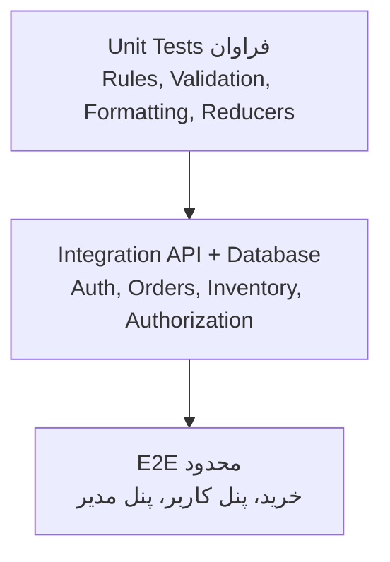

# راهبرد تست مبین سیلور

## 1. اهداف

- حفاظت از ثبت سفارش، قیمت و موجودی
- جلوگیری از دسترسی بین کاربران و نقش‌ها
- حفظ تجربه RTL و responsive
- تشخیص regression پیش از deployment
- قابل تکرار بودن smoke test و rollback validation

## 2. هرم تست پیشنهادی

## 3. تست‌های Backend

### Unit

- Hash و Verify رمز صحیح/غلط
- محاسبه total از UnitPrice و Quantity
- validation quantity، stock، category و status
- transitionهای مجاز وضعیت سفارش پس از پیاده‌سازی
- claim و mapping قراردادها

### Integration

- login موفق و ناموفق
- register و ایمیل تکراری
- endpoint عمومی بدون token
- account با token معتبر/منقضی
- Customer روی admin برابر 403
- سفارش خالی، محصول نامعتبر و موجودی ناکافی
- کاهش Stock و ذخیره OrderItem در تراکنش
- کاربر A نتواند سفارش کاربر B را ببیند
- ایجاد/ویرایش/حذف محصول با Admin
- خطای slug تکراری
- همزمانی سفارش روی موجودی آخر

برای isolation از دیتابیس موقت جدا یا container دیتابیس target استفاده کنید؛ تست به دیتابیس توسعه مشترک متصل نشود.

## 4. تست‌های Frontend

### Component

- ProductCard و وضعیت ناموجود
- badge سبد و تغییر quantity
- فرم login/register و پیام خطا
- ProtectedRoute برای anonymous، Customer و Admin
- حالت loading، error و empty dashboardها
- تبدیل مبلغ و تاریخ به نمایش فارسی

### E2E حیاتی

1. بازشدن خانه و عبارت بالای فروشگاه
2. جست‌وجو و ورود به جزئیات محصول
3. افزودن به سبد و تغییر تعداد
4. login مشتری و ثبت سفارش
5. مشاهده سفارش در داشبورد مشتری
6. login مدیر و مشاهده سفارش
7. تغییر وضعیت توسط مدیر
8. refresh داشبورد مشتری و مشاهده وضعیت جدید
9. افزودن محصول مدیر و مشاهده در فروشگاه
10. کنترل خروج و جلوگیری از بازگشت به route محافظت‌شده

## 5. ماتریس مرورگر و viewport

| نوع | حداقل پوشش |
|---|---|
| Mobile | 390×844 |
| Tablet | 768×1024 |
| Laptop | 1366×768 |
| Desktop مرجع | 1536×1024 |
| Browser | Edge/Chrome پایدار، سپس Firefox و Safari در CI/Device Lab |

کنترل‌ها:

- نبود overflow افقی
- منوی موبایل و focus
- خوانایی اعداد و متن RTL
- تصاویر بدون پرش layout جدی
- جدول‌ها و فرم‌ها در عرض کم

## 6. دسترس‌پذیری

- navigation فقط با صفحه‌کلید
- ترتیب منطقی focus در RTL
- label برای inputها و نام قابل‌دسترسی دکمه آیکونی
- contrast متن و حالت focus
- alt معنی‌دار تصویر محصول
- heading hierarchy
- اعلام خطای فرم و نتیجه عملیات برای screen reader

هدف پیشنهادی: WCAG 2.1 AA برای مسیرهای خرید و مدیریت.

## 7. امنیت و سوءاستفاده

- brute force و rate limit
- XSS در نام، توضیح، نشانی و search
- SQL injection با payloadهای شناخته‌شده
- JWT دستکاری‌شده، منقضی، issuer/audience غلط
- IDOR سفارش و پروفایل
- role escalation
- mass assignment روی نقش، مبلغ و موجودی
- request replay و duplicate order
- payload بزرگ و quantity مرزی
- webhook جعلی و replay درگاه آینده

## 8. کارایی

سناریوهای پایه:

- فهرست محصول با 1k، 10k و 100k رکورد پس از pagination
- burst مشاهده محصولات
- ثبت سفارش همزمان روی Stock محدود
- داشبورد مدیریت با حجم سفارش بالا
- asset، font و LCP صفحه اصلی

بودجه اولیه پیشنهادی در شبکه مناسب:

- API read p95 کمتر از 300ms
- create order p95 کمتر از 700ms بدون درگاه
- نرخ 5xx کمتر از 0.5%
- LCP صفحه اصلی کمتر از 2.5s

این اهداف باید با زیرساخت و داده واقعی بازتنظیم شوند.

## 9. تست داده و Migration

- migration از آخرین نسخه production روی clone امن
- rollback یا forward compatibility
- indexها و plan queryهای پرتکرار
- precision مبلغ و عدم استفاده از floating point
- timezone و تاریخ UTC
- حفظ snapshot نام و قیمت اقلام سفارش
- عدم orphan شدن OrderItem

## 10. Quality Gate CI پیشنهادی

1. restore قابل تکرار
2. build backend با warning به‌عنوان خطا در مرحله بلوغ
3. unit و integration tests
4. npm ci و frontend build
5. lint/typecheck
6. dependency و secret scan
7. E2E smoke روی artifact
8. انتشار گزارش تست و screenshot شکست

## 11. چک‌لیست پذیرش Release

- [ ] buildهای Release/Production موفق
- [ ] تست‌های unit و integration سبز
- [ ] E2E مسیر خرید، مشتری و مدیر سبز
- [ ] security scan بدون Critical/High تاییدنشده
- [ ] موبایل و دسکتاپ بررسی شده‌اند
- [ ] migration و rollback تمرین شده‌اند
- [ ] مستندات API و نمودار تغییر کرده‌اند
- [ ] smoke test و owner مانیتورینگ مشخص است

## 12. شواهد QA نسخه اولیه

اسکرین‌شات‌های فعلی در پوشه `qa/` نگهداری شده‌اند:

- `storefront-desktop.png`
- `storefront-mobile.png`
- `admin-dashboard-desktop.png`
- `customer-dashboard-desktop.png`

این فایل‌ها baseline بصری هستند؛ snapshot باید فقط پس از بررسی انسانی آگاهانه به‌روزرسانی شود.

